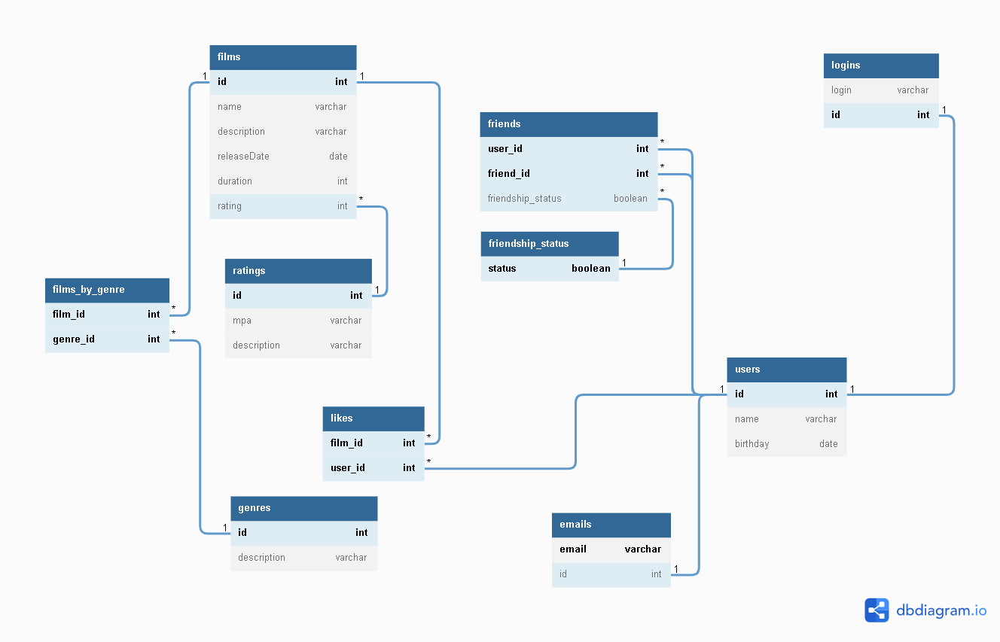

# java-filmorate
Template repository for Filmorate project.

# Это репозиторий проекта "Filmorate"

Наше приложение **умеет**:
1. Хранить пользователей и их друзей
2. Хранить фильмы и их рейтинги

Приложение написано на Java.

## Диаграмма базы данных (БД)


**Запросы к БД на языке SQL**
1. получение списка фильмов
```SQL
SELECT films.name
FROM films
```
2. узнать дату рождения пользователя c id = 3
```SQL
SELECT users.birthday
FROM users
WHERE users.id = 3
```
3. узнать кол-во лайков фильма с id = 3
```SQL
SELECT COUNT(film_id)
FROM likes
WHERE film_id = 3
```
4. узнать количество друзей пользователя с id = 3
```SQL
SELECT COUNT(user_id)
FROM friends
WHERE user_id = 3 AND friendship_status = TRUE
```
5. узнать добавил ли пользователь с id = 10 в друзья пользователя с id = 3
```SQL
SELECT friendship_status
FROM friends
WHERE user_id = 10 AND friend_id = 3
```
6. для отправки на проверку
